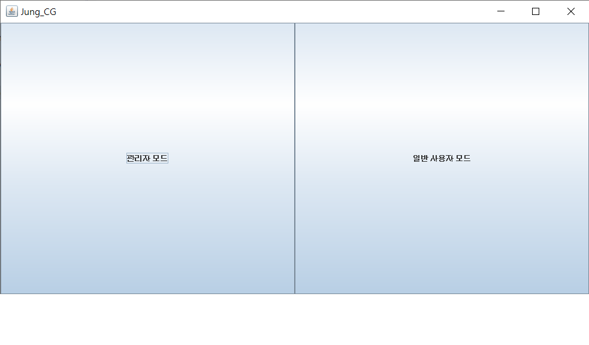
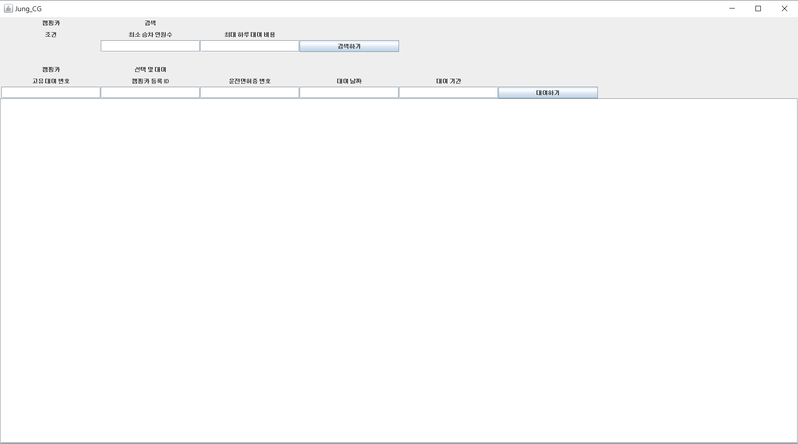
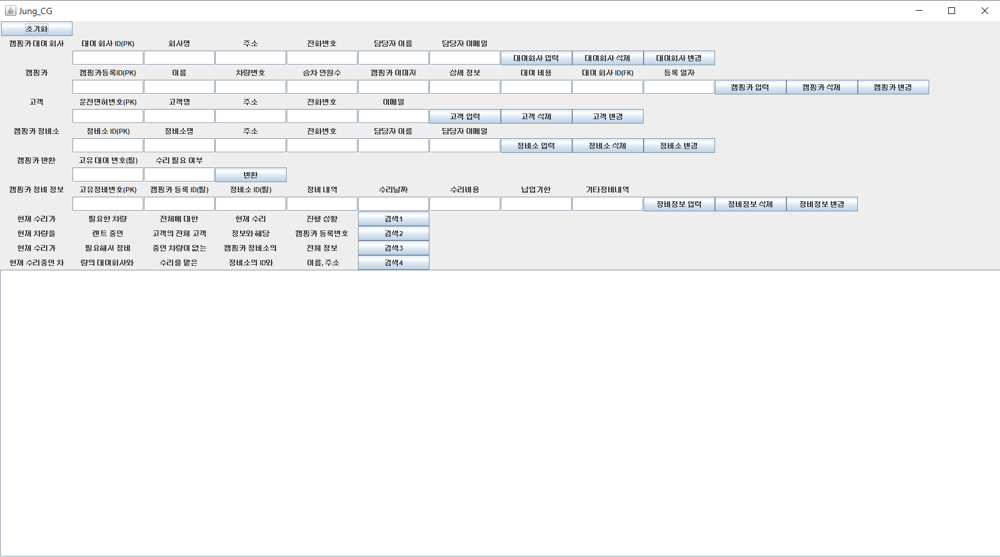
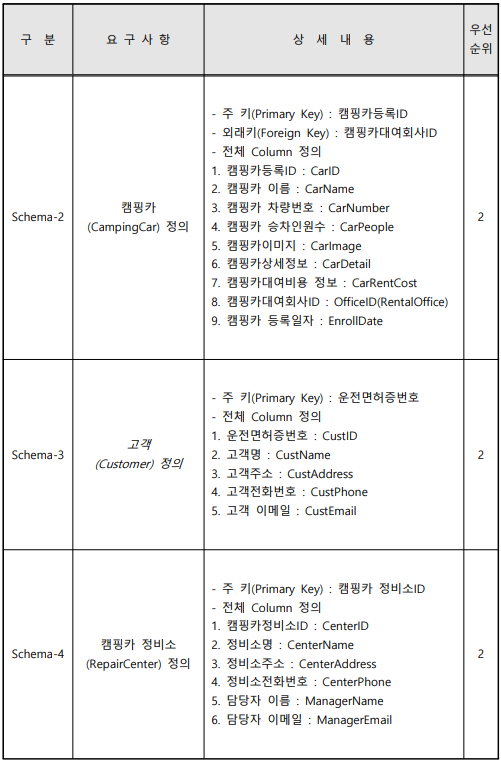
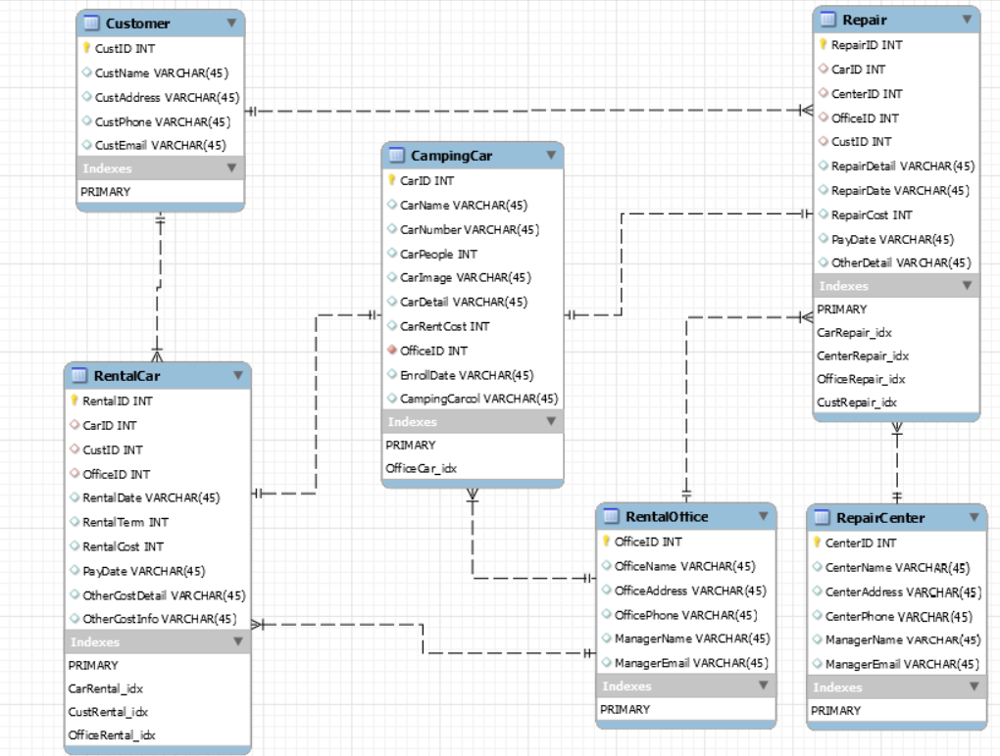
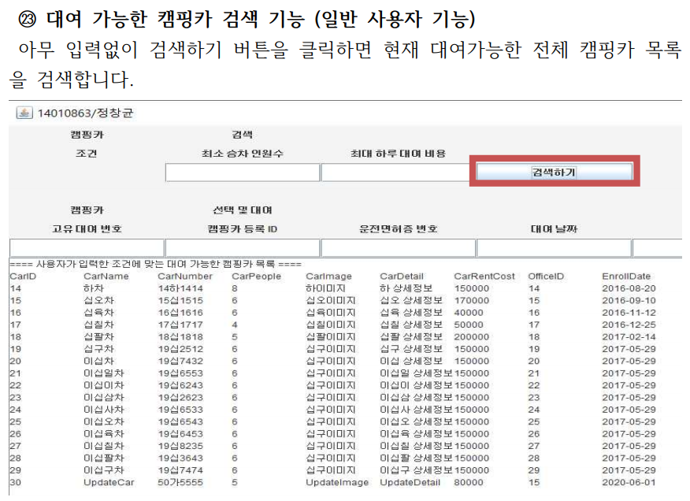
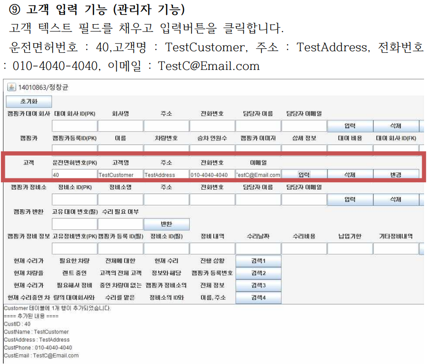
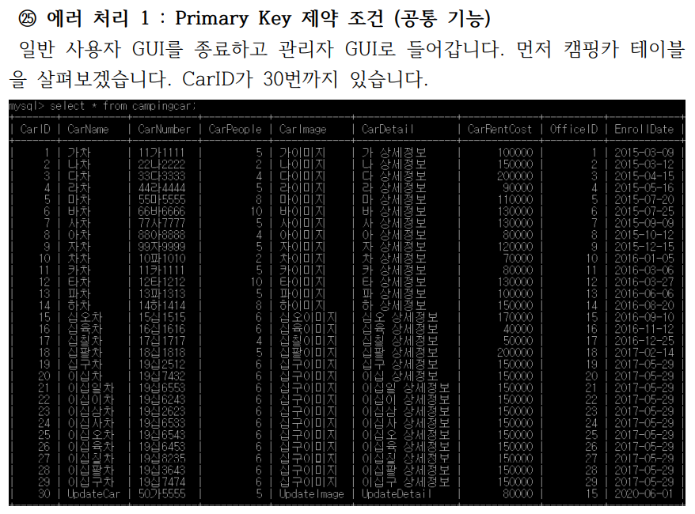
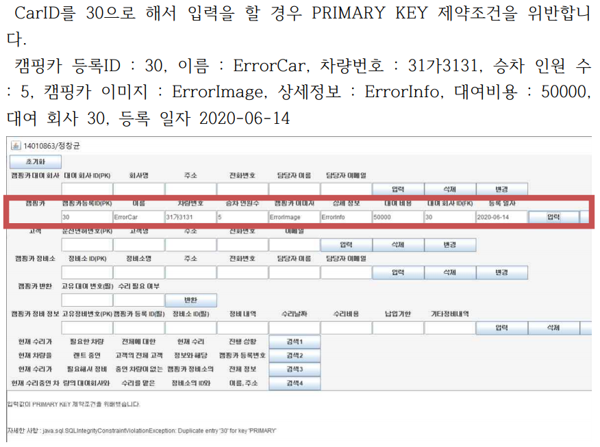

# Rent_CampingCar
- Manage and Rent CampingCar
- JDBC, Swing을 이용한 CampingCar Office 구현 (Customer / Manager)

-----------------

## Using
**1. DBMS** : MySQL 8.0.19

**2. 언어** : Java(JDK 1.8)

**3. IDE** : Eclipse

-----------------

    **1. 초기 화면**
    

    **2. 고객 페이지**
    
    

    **3. 관리자 페이지**
    

-----------------

## Document
- **Detailed Document** : can be found in each directory.

**1. 요구사항 명세서**

    

**2. ERD**

    

**3. Testing**

    

    

    

    

